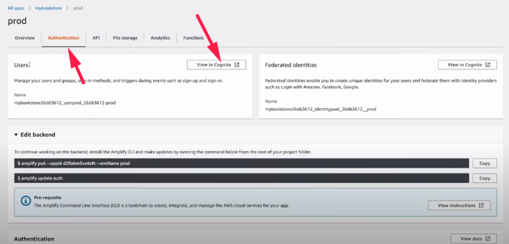
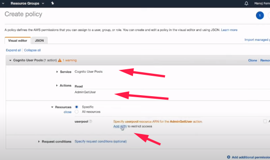
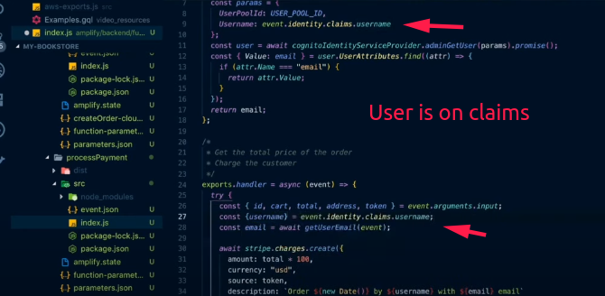

## Adicionando primeiros serviços

```shell
    npm i -g @aws-amplify/cli@4.24
    amplify configure
```


* ? Enter a name for the project ***mybookstore***
* ? Enter a name for the environment ***prod***
* ? Choose your default editor: ***Visual Studio Code***
* ? Choose the type of app that you're building ***javascript***
* Please tell us about your project
* ? What javascript framework are you using ***react***
* ? Source Directory Path:  ***src***
* ? Distribution Directory Path: ***build***
* ? Build Command:  ***npm run-script build***
* ? Start Command: ***npm run-script start***
* Using default provider  awscloudformation
* 
* For more information on AWS Profiles, see:
* https://docs.aws.amazon.com/cli/latest/userguide/cli-multiple-profiles.html
* 
* ? Do you want to use an AWS profile? ***Yes***
* ? Please choose the profile you want to use ***profile-anderson***

```shell
amplify add auth
```

* Using service: Cognito, provided by: awscloudformation
*  
*  The current configured provider is Amazon Cognito. 
*  
*  Do you want to use the default authentication and security * configuration? ***Default configuration***
*  Warning: you will not be able to edit these selections. 
*  How do you want users to be able to sign in? ***Username***
*  Do you want to configure advanced settings? ***No, I am done.***

```shell
amplify add storage
```
* ? Please select from one of the below mentioned services: ***Content (Images, audio, video, etc.)***
* ? Please provide a friendly name for your resource that will be used to label this category in the project: ***BookImages***
* ? Please provide bucket name: ***mybookstore57efba148c254b87a2fb73a466ed0b4e***
* ? Who should have access: ***Auth and guest users***
* ? What kind of access do you want for Authenticated users? ***create/update, read, delete***
* ? What kind of access do you want for Guest users? ***read***
* ? Do you want to add a Lambda Trigger for your S3 Bucket? ***No***

## Adicionando funções lambda

```shell
amplify add function
```
* ? Select which capability you want to add: ***Lambda function (serverless function)***
* ? Provide a friendly name for your resource to be used as a label for this category in the project: ***processPayment***
* ? Provide the AWS Lambda function name: ***processPayment***
* ? Choose the runtime that you want to use: ***NodeJS***
* ? Choose the function template that you want to use: ***Hello World***
* ? Do you want to access other resources in this project from your Lambda function? ***No***
* ? Do you want to invoke this function on a recurring schedule? ***No***
* ? Do you want to configure Lambda layers for this function? ***No***
* ? Do you want to edit the local lambda function now? ***No***

```shell
amplify add function
```
* ? Select which capability you want to add: ***Lambda function (serverless function)***
* ? Provide a friendly name for your resource to be used as a label for this category in the project: ***createOrder***
* ? Provide the AWS Lambda function name: ***createOrder***
* ? Choose the runtime that you want to use: ***NodeJS***
* ? Choose the function template that you want to use: ***Hello World***
* ? Do you want to access other resources in this project from your Lambda function? ***No***
* ? Do you want to invoke this function on a recurring schedule? **No**
* ? Do you want to configure Lambda layers for this function? **No**
* ? Do you want to edit the local lambda function now? **No**

```shell
amplify add api
```
* ? Please select from one of the below mentioned services: ***GraphQL***
* ? Provide API name: ***mybookstore***
* ? Choose the default authorization type for the API ***Amazon Cognito User Pool***
* Use a Cognito user pool configured as a part of this project.
* ? Do you want to configure advanced settings for the GraphQL API ***Yes, I want to make some additional changes.***
* ? Configure additional auth types? ***Yes***
* ? Choose the additional authorization types you want to configure for the API ***API key***
* API key configuration
* ? Enter a description for the API key: ***Guest user access*** 
* ? After how many days from now the API key should expire (1-365): ***365***
* ? Configure conflict detection? ***No***
* ? Do you have an annotated GraphQL schema? ***No***
* ? Choose a schema template: ***Single object with fields (e.g., “Todo” with ID, name, description)***
* ? Do you want to edit the schema now? ***Yes***

### Lembrar de adicionar

* Graphql
* Lambda functions(adicionar user pool?)

```shell
amplify push
```

* ? Do you want to generate code for your newly created GraphQL API ***Yes***
* ? Choose the code generation language target ***javascript***
* ? Enter the file name pattern of graphql queries, mutations and subscriptions ***src/graphql/**/*.js***
* ? Do you want to generate/update all possible GraphQL operations - queries, mutations and subscriptions ***Yes***
* ? Enter maximum statement depth [increase from default if your schema is deeply nested] ***4***

### Configuration

### Pegar o user pool id

Vá no aws exports na pasta src, ache o campo "aws_user_pools_id" e cole na função processPayment.  

### Pegar credencias do stripe


### Update nos arquivos com a public key

Checkout.js
processPayment (lambda function)

### Create order configuration

On the src folder of the the lambda function

```shell

npm i uuid

```
Pegue o nome da tabela 

```shell

amplify console

```


```shell

amplify push

```

## React side

```shell
npm i 
npm start
```

Não existem produtos criados ainda.

* Por questão de estabilidade as queries, mutations foram separadas. 
    * Passa as queries e mutations do video_resources/api para src/api
* Faça o login.

### Faça o usuário admin para que possa registrar livros

```shell
amplify console
```




### Configure a permissão do S3

* https://docs.aws.amazon.com/AmazonS3/latest/dev/example-bucket-policies.html#example-bucket-policies-use-case-2


### Stripe default card


### Remove orders from product

User cant see order, and by default mutations is using

### Lambda autrhorization





De maneira similar, de autorização para a outra função


Se tudo estiver correto, e um pagamento efetuado com sucesso, pode ser verificado no dashboard do sripe.

### Corrigir o erro de usuário



## Hosting

```shell
amplify add housting
```

* ? Select the plugin module to execute ***Amazon CloudFront and S3***
* ? Select the environment setup: ***DEV (S3 only with HTTP)***
* ? hosting bucket name ***mybookstore-20200822014236-hostingbucket***
* ? index doc for the website ***index.html***
* ? error doc for the website ***index.html***
